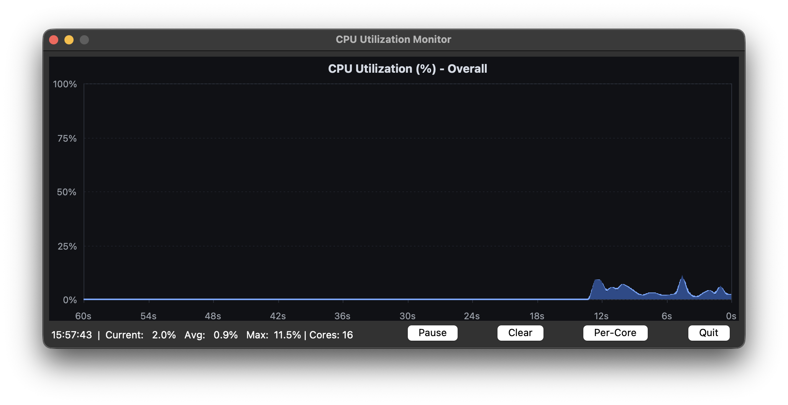
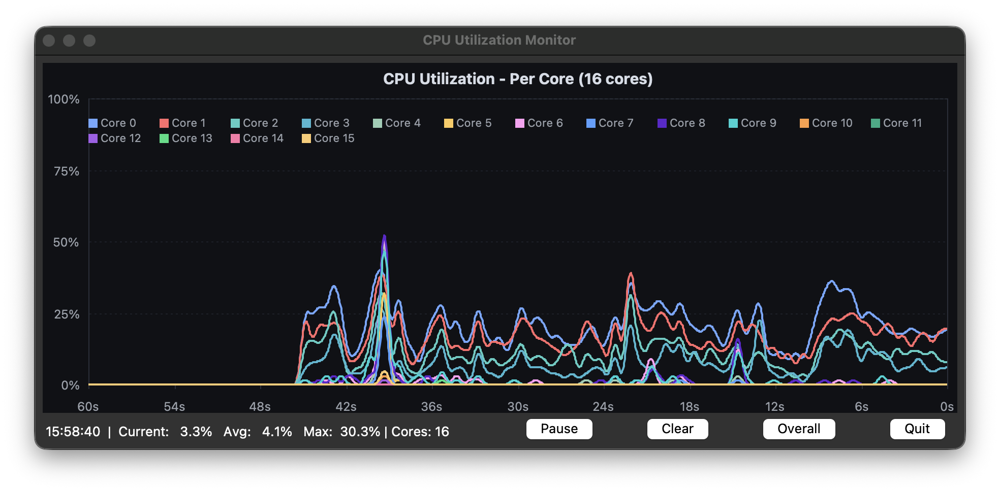

# CPU Utilization Monitor

[](https://github.com/johnmulder/cpu-monitor/actions)
[](https://www.python.org/downloads/)
[](https://opensource.org/licenses/MIT)

Real-time CPU usage monitor with per-core charts and a Tkinter interface.

## Features

- Live updates with configurable intervals and history windows
- Overall and per-core CPU charts
- Pause, clear, view toggle, and quit controls
- Cross-platform CPU readings through `psutil`

## Screenshots

### Overall CPU Usage View



### Per-Core CPU Usage View



## Quick Start

```bash
git clone https://github.com/johnmulder/cpu-monitor.git
cd cpu-monitor
pip install -e .
cpu-monitor
```

For development:

```bash
pip install -e .[dev]
pre-commit install
```

## Usage

```bash
# Overall CPU view
cpu-monitor

# Per-core view with fast updates
cpu-monitor --per-core --interval 250

# Limit to first 4 cores with extended history
cpu-monitor --per-core --max-cores 4 --time-window 120
```

## Command Line Options

| Option | Description | Default |
|--------|-------------|---------|
| `-i, --interval` | Update interval in milliseconds | 500 |
| `-t, --time-window` | History window in seconds | 60 |
| `--per-core` | Start in per-core view | False |
| `--max-cores` | Max cores to display, 0 means all | 0 |

## Development

```bash
pytest
ruff check src tests
ruff format src tests
mypy src
pre-commit run --all-files
```

## Project Structure

```text
src/cpu_monitor/
├── __init__.py
├── main.py
├── cli/
│   ├── __init__.py
│   └── argument_parser.py
├── core/
│   ├── __init__.py
│   ├── cpu_reader.py
│   └── data_models.py
└── ui/
    ├── __init__.py
    ├── chart_renderer.py
    ├── colors.py
    └── main_window.py
```

## License

This project is licensed under the MIT License. See [LICENSE](LICENSE).
